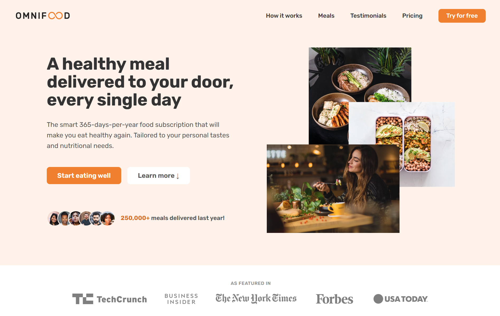

# Omnifood 🍽️

Welcome to **Omnifood**, a modern, responsive, and interactive food delivery website designed with a focus on aesthetics, user experience, and simplicity.

## 🌐 Live Demo

You can view the live version of the website here:  
👉 [Omnifood - Arunav Singh](https://omnifood-arunav.netlify.app/)

---

## 🛠️ Features

- **Responsive & Mobile Friendly**: Optimized for all devices and screen sizes.
- **Modern UI/UX**: Beautiful design with smooth animations and transitions.
- **Dynamic Interactivity**: Engaging UI elements with user-friendly interactions.
- **User Testimonials Section**: Realistic feedback simulation from customers.
- **Navigation & Smooth Scrolling**: Intuitive and responsive navigation experience.

---

## 💻 Built With

- **HTML5**: Semantic markup for a better web structure.
- **CSS3**: Advanced layouts with responsive techniques & animations.
- **JavaScript**: Enhancements for interactivity and user engagement.

---

## Screenshots

---

Developed by: Arunav Singh
